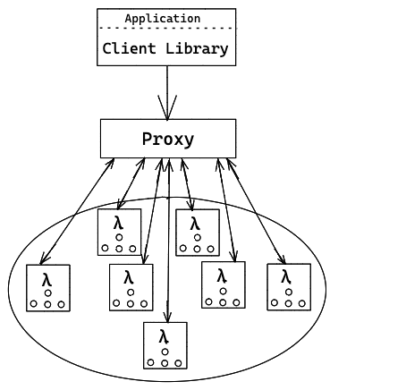
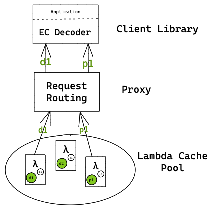
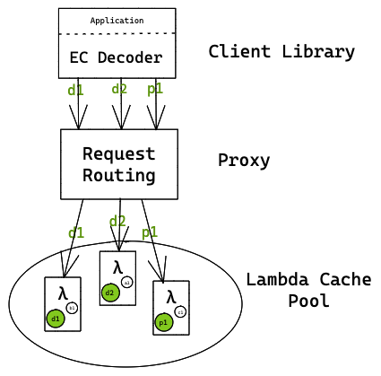

I recently stumbled on a whitepaper, [InfiniCache: Exploiting Ephemeral Serverless Functions to Build a Cost-Effective Memory Cache](https://arxiv.org/pdf/2001.10483.pdf) and it appeared to be very interesting given my obsession with Serverless technology. I decided to read it and learn how Infinicache can be built. 

Infinicache looks to leverage the Serverless Pay-Per-Usage pricing model for building a highly scalable distributed cache. Assuming that, the reader has some basic understanding of Cloud Technology, Caching and Serverless/(Function as service - FaaS) and is keen to explore the possibilities with Serverless. The evaluation and the solution for this service are built around AWS Cloud Services.

### Introduction

Today’s web applications are increasingly storage-heavy and rely heavily on IMOC (In-memory object caching) caching to deliver desirable I/O performance. And if we want to deliver desirable performance for all the web API's in a cluster, you will need a distributed common cache(Redis, Memcache, Hazelcast, etc.) that can be used by all the web API. 

Caches are stateful applications, they maintain state of the objects which are later returned to the user. They are opposite of stateless HTTP servers.

These caches are generally deployed on persistent cloud instances and have a fixed cost to keep them running. It also does not depend on the number of requests it serves. You pay the cost for the duration of the cloud instance type that was running.

These IMOC systems are used only for storing small-sized objects ranging from few bytes to few KBs. This is mainly due to the high cost of main memory. Refer this list [here](https://aws.amazon.com/elasticache/pricing/) for the costs on EC2. 

Storing large objects in IMOC is not optimal as these objects (few MB’s to GB’s) occupy a lot of space and consume larger network bandwidth. And these large objects can also lead to eviction of smaller objects to make space for large objects (basis [eviction policy](https://support.redislabs.com/hc/en-us/articles/203290657-What-eviction-policies-do-you-support-) - LRU, LFU, Random, etc. on Redis or similar systems)

The idea is to see how the memory provided by the serverless functions on many nodes can be leveraged together to build a Distributed and Highly Available object cache/store (IMOC) that is as performant as other Distributed Caches and is fault-tolerant.

| Service          | Cost (per GB)                                            |
|------------------|----------------------------------------------------------|
| AWS ElasticCache | $0.016/hour                                              |
| AWS S3           | $0.023/month                                             |
| Lambda           | $0.2 per 1M invocations $0.00001667 for every GB-sec |
|                  |                                                          |

If you would like to understand more about AWS Lambda computation, kindly refer [this](https://aws.amazon.com/lambda/pricing/) article

So, we understand from the above that ElasticCache is very expensive and though S3 is cheaper, performance is less than desirable (network call to S3 and object transformation is needed et al.)  and is expensive when used in conjunction with networked IMOC. 

It would be great if we can achieve the best from both the worlds. i.e. have the cost-effectiveness close to S3 storage (including support for large objects) and get the performance of an IMOC. This is what we will try and explore in the next few sections.

With the above pricing and recent advances in [serverless technology](https://aws.amazon.com/serverless/) and **[Provisioned Concurrency](https://aws.amazon.com/blogs/aws/new-provisioned-concurrency-for-lambda-functions/)** (a feature that keeps functions initialized and hyper-ready to respond in double-digit milliseconds), it is possible to leverage this feature to provide/build persistence with AWS Lambdas.  

Also, providers only charge customers when a function is invoked, in this case, when an object is accessed or inserted. Thus the memory capacity on serverless used to cache an object is billed only when there is a request hitting that object or inserting an object. The serverless IMOC reduces the monetary cost of memory capacity compared to other IMOCs that charge for memory capacity on an hourly basis whether the cached objects are accessed or not.

### Challenges & Ideas

Before we start to look at the design, lets list down the merits and demerits of Serverless technology 

**Advantages:**

- Fully managed infrastructure 
- Focus on the core logic/function 
- Scalability to thousands of cache nodes
- Pay-per-request (the serverless memory is free when it is not executing as long as the function is not claimed)

**Challenges/Limitations with Lambda:**

- No data availability guarantee
- Lambda can be claimed anytime, no guarantee
- Lambda execution can run at most 15 mins only after which it returns
- Executions are billed per 100 ms, even if your request completes earlier
- Banned inbound network - needed for implementing the server
- Limited per-function resources
- Memory up to 3 GB and up to 2 CPU cores

From the above challenges, we understand we need to ideate on below capabilities

**Ideas**

- Leverage outbound TCP connections to issue multiple requests to the function
- Leverage the billing cycles (rounded to 100ms) and try and fit as many requests as possible
- Keep Lambdas from reclaiming awake by issuing warm-up requests that just return without the full processing 
- Use a backup node for every Lambda node so the backup node can be used if the primary node is reclaimed

### InfiniCache Design

Let's see how InfiniCache solves this problem.

InfiniCache exploits and orchestrates Serverless functions’ memory resources to enable elastic pay-per-use caching. InfiniCache’s design combines [erasure coding](https://en.wikipedia.org/wiki/Reed%E2%80%93Solomon_error_correction) (using [Reed Solomon code](https://www.rubrik.com/blog/erasure-coding-rubrik-doubled-capacity-cluster/)), intelligent billed duration control, and an efficient data backup mechanism to maximize data availability and cost-effectiveness while balancing the risk of losing cached state and performance.
InfiniCache also has a well-designed method for storage of bigger objects which we will explore in the [PUT](#put) section

Let's look at the typical architecture and the various components involved here viz. [Proxy](#Proxy), [Client Library](#client library) & [Lambda function](#cache nodes/pool)

#### Client Library 

Client library contains an Erasure Coding (EC) module and it exchanges EC-encoded object chunks between client library and Lambda nodes via the proxy. 
The client library runs within the application (it's a library) and determines the proxy (and the corresponding Lambda pool) based on Consistent Hashing-based load balancing approach. 

It is responsible for below functionality   

- Use Consistent hashing to Load balance the requests across a set of available proxies
- Transparently encode/decode data objects using the EC module and split larger objects in chunks to leverage parallelism across lambda nodes and the available bandwidth
- Determine where EC-encoded chunks are placed/set on a cluster of Lambda nodes
- Cache invalidation on overwriting/new data or cache insertion on reading miss (assuming [write through cache](https://bluzelle.com/blog/things-you-should-know-about-database-caching))

  

The client library then encodes the object with a pre-configured EC code ((d+ p) using a Reed-Solomon (RS) code) and produces several object chunks (configurable), each with a unique identifier and the chunk sequence number (since we are splitting the bigger ones into chunks based on EC code).

With **Cache Systems**, we have only 2 functionalities that are needed. Insert/Update an item. Retrieve an item.
So, in any cache system, we need 2 APIs to communicate with the cache service. viz. GET and PUT

##### **GET - get(key)**

- The client sends GET request

- Client library invokes associated Proxy using Consistent Hashing

- The proxy then looks up the mapping table to find relevant chunks for the key and the Lambda nodes. Chunks to object mappings are captured in a mapping table.

- Cache nodes transfer object chunks to the proxy

  

Example. scenario 
If d2 does not respond in time, then to minimize the impact of tail latency, we ignore d2 and use d1 data (since RS code config is 2 + 1 and straggler data that can be tolerated in only 1) and proceed with passing d1 and p1.

- Proxy streams k chunks in parallel to client
- Also if d2 chunk is lost,  data can be constructed using Erasure Code using d1 and p1 

<!--up to p object chunk losses given an RS code (d+p) and will insert into lambda cache node-->

##### **PUT - put(key, value)**

- The client sends the PUT request
- The object is split and is encoded into k data chunks + r parity chunks using Reed Solomon code
- The object chunks are sent to the proxy in parallel
- Proxy captures the mapping of chunks to a key and Lambda nodes in the mapping table
- Proxy invokes correct Lambda cache node
- Proxy streams chunks to cache nodes
- For larger objects, the client library can choose a more aggressive EC code. Details in [references](#References)

#### Proxy 

We need a proxy since Lambda does not allow inbound TCP connections (like a server). Each proxy manages a Lambda node.
A proxy is a software that can be run on a VM and provides the following features.

- Stores the mapping between chunks of objects and nodes
- Manages a pool of lambda nodes and also maintains the metadata for mapping object chunks and Lambda nodes 
- Proxy also manages the memory of each Lambda node including eviction if there is no usage (LRU)
- Establish and maintain persistent TCP connections with the lambda nodes within its pool since Lambda cant run in server mode
- Proxy lazily validates the status of Lambda node every time there is a request to send
- Optimize the usage of Lambda’s billing cycle
- Also responsible for lambda cache node management and request and routing to forward the request to the corresponding lambda function
- The proxy server periodically invokes sleeping Lambda cache nodes to extend their lifespan
- Proxy also coordinates data migration and moving data to new Lambda in case one of the 2 replica nodes is claimed.
- The proxy sends out backup commands to Lambda cache nodes and lambda nodes perform delta-sync with its peer replica. Source lambda propagates delta-update to destination lambda

#### Cache Nodes/Pool

Consists of a cluster of Lambda cache nodes, which are logically partitioned and managed by multiple proxies. 
Each proxy orchestrates a Lambda cache pool that is responsible for cache management, write-through cache logic. 
Cache node has the following features

- Each node has a replica/backup node to make sure no data is lost when a certain node is claimed
- The Lambda runtime tracks cached key-value pairs that are sorted with a CLOCK-based priority queue
- When one of the nodes goes down the backup node can serve those requests and going forward the backup node can become primary node
- Lambda runtime uses a timeout scheme to control how long a Lambda function runs which helps it to maximize the use of each billing cycle (remember Serverless is billed in 100 ms)
- Lambda runtime also returns 2-10 ms before the 100 ms window ends
- It also extends the timeout if it cant serve more requests within the current billing cycle (100 ms) 
- The proxy sends a pre-flight message (ping) each time a request is forwarded to the Lambda node which helps the Lambda to delay the timeout accordingly
- Has an efficient & low network overhead backup/delta-sync mechanism that is less reliant on the proxy and works with communication between 2 Lambda nodes using a bridge relay 
- Also has support for warm-up so Lambda can stay for the configured time

Overall the entire architecture is very smart and innovative. Encourage all to read the white paper to understand in detail.

### Key Observations
Some key observations based on experiments conducted that are worth mentioning from the paper

- In memory Object caching system can be built using stateless and ephemeral cloud functions
- A cache system that charges based on requests instead of capacity usage.
- A Lambda function that finishes execution is kept by AWS for at most 27 minutes if that function is not invoked again.
- The lifespan of Lambda can be extended using warm-up functions
- Leverages erasure coding to provide fault tolerance against data loss due to function reclamation by the provider
- Performance can be improved by leveraging the aggregated network bandwidth of multiple cloud functions in parallel 
- InfiniCache provides cost-benefit up to almost 30x for all object types (small and big)
- InfiniCache can effectively provide 95.4% data availability for each one hour window
- InfiniCache achieves 31 – 96x tenant-side cost savings compared to AWS ElastiCache for a large-object only
production workload
- Small objects perform better in the elastic cache and large object cache performance is almost the same between Elastic cache and InfiniCache. InfiniCache is better by 100 times compared to s3

### Reference

https://arxiv.org/pdf/2001.10483.pdf

https://www.usenix.org/sites/default/files/conference/protected-files/fast20_slides_wang-ao.pdf

https://lumigo.io/blog/unlocking-more-serverless-use-cases-with-efs-and-lambda

https://www.honeycomb.io/blog/secondary-storage-to-just-storage

https://www.datadoghq.com/state-of-serverless

https://github.com/mason-leap-lab/infinicache

