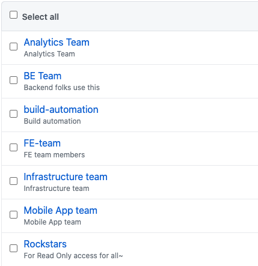
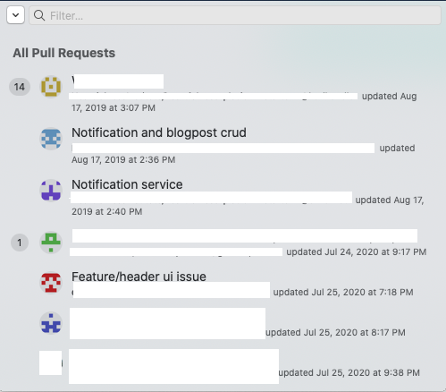

---

title: Git migration to Github and LFS
#categories: [tech, learnings, productivity]
tags: [tech, migration, productivity, git, hacks]
layout: post
permalink: /migrate-to-github-and-lfs
---


Last week we wanted to migrate from a big git provider to github and I thought I will list down the setup here, few details around LFS which any new growing startup teams can adopt and leverage for their teams.

### Background

[Git](https://en.wikipedia.org/wiki/Git) is so ubiquitous that it has become synonymous with [source code version control systems](https://en.wikipedia.org/wiki/Comparison_of_version-control_software) and folks rarely remember that others exist (including me). Had used Subversion and Visual Source Safe (VSS) but I was looking for [Distributed Version Control Systems](https://www.atlassian.com/blog/software-teams/mercurial-vs-git-why-mercurial). I am yet to try [Mercurial](https://www.mercurial-scm.org/) and have heard lots of [good things there too](https://www.joelonsoftware.com/2013/03/11/town-car-version-control/).

Coming to choosing a provider, many devops(system administrators) would suggest hosting and managing source code version control (git) servers on their own and tell you that you can save costs and have unlimited repositories (lots of unorganized code).
I would not sign up for managing one, unless you are a big corporate (you need to protect your IP) or a company that needs to guard its trade secret from every possible entity and the cost of managing them (yes, uptime and no data loss and security - it can get expensive) over weights the benefits it brings.

I would politely nudge them per above guidelines and be wiser (choose a provider). Also, every employee in a company needs to remember their core mission, their raison d'être. If your core mission is not to manage VCS servers and maintain uptime, hire someone who does it really well.

Also, Github now allows private unlimited repositories for teams of any size absolutely [free](https://github.com/pricing) ($0/month) with 2000 hours of Github Actions. So the cost effectiveness/saving (not known till you loose data with self hosted 😊 ) is not an argument anymore. You don't get branch protection only that is available for paid version ($4/month). So you are free to use this.

Github is the default choice for many. Personally for me, it was the tooling, ubiquity, community and ecosystem and the many new initiatives like storing the code in [Arctic](https://archive.github.com) which shows how deeply they care about their core business.

### Migration

Coming to migration, Github offers a very simple UI led workflow to move from any other git provider. You can visit this [url](https://github.com/new/import) and follow the steps and voila, you are done. You need a read only user from the provider you want to move from. You may follow this for all the projects you want to move over and you would have completed this in minutes depending on the number of repositories and size of the repositories (including files/no of commits, file size etc.)

For command line folks, you may try the below steps


-  Get a list of repositories from our current provider, most big providers have a REST endpoint, then for each repository
  -
    - Clone locally
    - Create empty repository with the same name on github.com (create folder and do hub create and push repository)
    - Go to the root location of this repository
    - Now add remote origin of the new provider
    - Push the repository branchwise


Here is a small [script](https://gist.github.com/vinayakg/45160e15c8d70e410ec1b42787481ee1) (untested, so please make sure before using it) for bitbucket.


The migration ran fine for most of the repositories except few of them where it started throwing error as seen below

### Issues & Learnings


One of the repositories, I got the below error.
```bash
Enumerating objects: 61082, done.
Counting objects: 100% (61082/61082), done.
Delta compression using up to 8 threads
Compressing objects: 100% (24307/24307), done.
Writing objects:  12% (7863/61082), 30.45 MiB | 88.00 KiB/s
Writing objects:  12% (7863/61082), 34.26 MiB | 78.00 KiB/s

Writing objects:  13% (8421/61082), 78.02 MiB | 56.00 KiB/s
Writing objects: 100% (61082/61082), 259.67 MiB | 194.00 KiB/s, done.
Total 61082 (delta 38055), reused 58740 (delta 35901), pack-reused 0
remote: Resolving deltas: 100% (38055/38055), done.
remote: error: GH001: Large files detected. You may want to try Git Large File Storage - https://git-lfs.github.com.
remote: error: Trace: 73b6e8252aa0d89378555a8c60e58609
remote: error: See http://git.io/iEPt8g for more information.
`remote: error: **File application/logs/log-2018-08-18.log is 227.92 MB;** this exceeds GitHub's file size limit of 100.00 MB`
To gh:TEAM/private-html.git
 ! [remote rejected]     master -> master (pre-receive hook declined)
error: failed to push some refs to 'gh:TEAM/private-html.git'
```

As you can see above, there is an error and the repository did not get pushed. When I tried to locate the file at the path above, the path was not found. I was surprised for sometime and was wondering why is git behaving this way. Before I tried to search the internet for help, it dawned on me that git is a version control system and you can rollback/checkout to any version you like using the commit-id. Then I understood that these files were from previous commits and I was on the latest commit, so I wont see them.

Also, this file made it to the previous version control system since such limits did not exist on that provider. New learning - providers have different limits on file sizes when it comes to considering files under git lfs. I verified this by cloning the repository from old provider and I did not see any git-lfs status. Also I did not see anything on settings page of the provider.

This would happen for any github repository under free plan, since Github only allows files smaller than 100MB, aka meet [git-lfs](https://docs.github.com/en/github/managing-large-files/about-git-large-file-storage). So my next reaction was to upgrade to a paid plan.

Essentially, git-lfs lets you reduce your git clone and git fetch/pull size by using pointers to the remote git lfs server. Essentially you only download the large file when you `git checkout` that large file, till then its just a pointer. This is needed since git stores the entire history of all the commits inside .git folder like a graph. So any changes to larger files are copies in your .git which increase your download and disk size. In short, git-lfs lets you download them lazily. More details [here](https://www.atlassian.com/git/tutorials/git-lfs).

Then I told myself, before I upgrade to a paid plan, let me see if I can delete these files permanently since I don't need them and they are unnecessary in the repository. I had decided to upgrade post completion of experiment.

In order to delete files from history, you need to follow the below steps

```bash
git clone REPO_LOCATION # Clone the repository, use git clone -b REPO_LOCATION
git remote rm origin # Remove the origin
git filter-branch --index-filter 'git rm --cached --ignore-unmatch application/logs/log-2018-08-18.log' HEAD # delete the file and rewrite the history
git reflog expire --expire=now --all && git gc --prune=now --aggressive # Remove garbage and lingering files
git remote add origin REMOTE_LOCATION# Add the github origin here
git push origin master
```
This has to be done for all the branches that you need, individually else your other branches will have the same error as seen above.


### SETUP ⚙️

Since this was a fresh instance of the repositories on a new provider, had a chance to setup 2 factor authentication by default for all users. Security first.
When you setup 2 factor authentication, you need to Personal Access Tokens or use ssh config, the same github login password does not work anymore and rightly so.

If you would like to use Personal access token, you may generate one from the link [here](https://github.com/settings/tokens), it is similar to App Passwords on most services supporting 2FA.
If you want to use SSH for git access, you may refer one of my previous [article](https://vinayakg.dev/staying-sane-using-multiple-git-accounts).

#### Access & Roles 

I believe every developer in the org should have read access to all the repositories, they can read and request for write access once they are ready with a PR.
Write access is granted to developers who need to commit changes to certain repositories, else its read.

On a very high level, in any organization, one can divide various teams as represented in the picture. Once you have done that, it becomes easy to manage access across projects.



Now when you would like to grant access/invite a new user, you just need to select the groups that developer should be included in. Hope this helps to streamline access and maintain visibility on write access.

I prefer using a separate user (under build-automation) for CI/CD purposes. This makes it is visible and can be rolled back/changed and tracked easily.

### TOOLS 🧰

I have been using github tools for quite sometime and I have my own list of tools that help me remain productive everyday.
Below are the tools that you might find beneficial.

#### Trailer

[This tool](https://github.com/ptsochantaris/trailer) helps me look at all the pull requests status in one glance from the MAC status bar, lets me filter on repository/individual names and works like a charm. No more hopping between multiple repositories. It supports multiple accounts and multiple providers too.




#### VS Code Pull Request Github

[This tool](https://github.com/microsoft/vscode-pull-request-github) Helps me review PR's like a ninja using VS Code, have configured keyboard shortcuts to use up and down arrows within editor to move between diffs and for switching between side by side and inline diffs. I find reviewing code on github.com very limiting since reviewing on web can never be a first class experience, I like download the code and reviewing it.

The topic of code review and PR review and process is an interesting topic and warrants dealing in detail, so I wont try and cover here.

### Closing thoughts 💭

- Understand your business domain and focus on what is core to your business
- Pick the right tool for the right job, use what makes everyone comfortable
- Maintain right access pattern for your team that has visibility and freedom
- Don't settle with a workflow/tool till you feel there could be something better, most tools I have found after such retrospection

### Next Steps

- Leverage github actions to configure static analysis/linters on Pull Request/commit
- Use github actions to find [secrets](https://github.com/marketplace/actions/gitleaks) before they get discovered online and abused on PR/commit
- Leverage [Phabricator](https://www.phacility.com/phabricator/) to stream line code reviews and also use the workboards

### References 📚

https://medium.com/collaborne-engineering/how-to-migrate-a-private-repository-from-bitbucket-to-github-6cddedd5d73

https://chrisshort.net/permanently-remove-any-record-of-a-file-from-git/

https://stackoverflow.com/questions/49018053/how-large-does-a-large-file-have-to-be-to-benefit-from-git-lfs

https://www.atlassian.com/git/tutorials/git-lfs

https://github.com/sdras/awesome-actions


