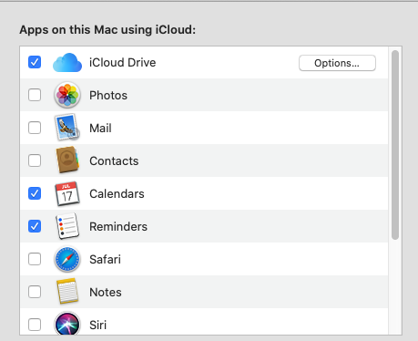
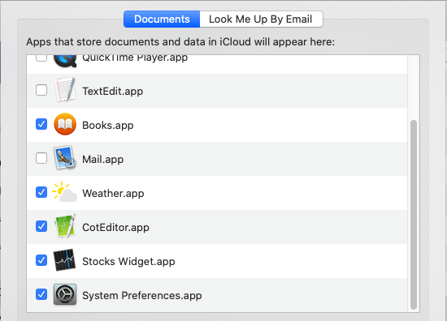
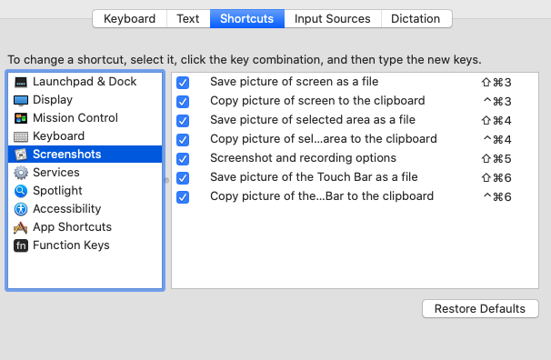

---

title: How to Setup your Mac
#categories: [tech, learnings, productivity]
tags: [tech, setup, productivity, brew, hacks]
layout: post
permalink: /how-to-setup-your-mac
---


I have been using Apple MacBook for the last 1.5 years and had set it only once when I started to use. The next time I wanted to setup, it was again a lot of reading and effort and I still felt I don't have a good control on the setup. In short I did not have the steps to reuse again for a future setup. So I decided to document my setup this time for my own reference and for others too who might find it useful for setting up their system in the most easiest, semi-automatable and auditable (yes, that's very important in today's age) way. And most of my earlier systems have been windows including a Surface Pro 3 which is still working and handy and doubles as a laptop and a tablet, hence I have steps for them but not for MacOS, so here we go.


## Background

I bought a new [MBP 2019](https://support.apple.com/kb/SP799?locale=en_IN)  from US (they are cheaper in US) just in time before the pandemic and this machine has been extremely helpful for all the work I throw at it. Have also setup my remote workstation recently with an external monitor, et al. which I will cover in the subsequent blog posts. 

Recently I wanted to reset this laptop and set it from the ground up. There are a lots of documents on the internet talking about the setup and some are extremely [useful](https://sourabhbajaj.com/mac-setup/) too, but I wanted a setup script/document that can be reused on existing setups as well with the ability to use/import the previous settings from various tools and utilities that I have come to rely on in my daily life.

Being a developer, I also like the idea of being able to tweak my system to suit my working style and make me more productive. So, some of the tools and settings that are listed below are also based on my experience using similar tools in the Windows ecosystem. My endeavor has always been to use the best tool possible that is convenient, easy and makes me efficient. So this article assumes basic knowledge and awareness about systems and tools. If I miss elaborating certain things here, please do let me know and I will add them here. 

You may also restore your complete machine from a previous copy using either [Time Machine](https://support.apple.com/en-in/HT203981) or [Super Duper](https://www.shirt-pocket.com/SuperDuper/SuperDuperDescription.html), but this blog post is about setting up a computer fresh (either on a new or existing device).

This blog can also be considered as a complete guide to setup a new MacBook without having to worry about spamware/malware/adware, they are all tested by me personally and have helped me from time to time. Since tools are continuously evolving, I will make sure to keep it updated as I change things at my end.


## Setup ⚙️


### Reset your Mac (existing devices only)

Before you begin to setup your Mac, make sure reset you Mac to factory settings by following the steps mentioned [here](https://mackeeper.com/blog/post/473-step-by-step-guide-to-reset-mac-to-factory-settings/). The steps have changed a bit, once the screen shows up post Cmd + R make sure to choose Erase Options. Then choose Reinstall MacOS. Once you choose reinstall MacOS, you need to connect with your wi-fi so the OS can be downloaded over the internet so that the installation can complete. This process can take ~1-2 hours (based on your connection speed).


### Connect Apple ID

Once the OS is downloaded and setup, you will be asked to choose some settings for transferring data, location, et al. You may follow [this](https://www.imore.com/how-set-your-new-mac) guide for those steps. 

Now connect your Apple ID to be able to synchronize other devices, previous install settings, et al. You may also skip this if you don't want to connect to any Apple ID, have not tried this - but you may try 😀. I personally connect my Apple ID as it lets me synchronize my app settings (Stocks, iBooks, Podcasts, Weather, etc.), Send/Receive calls and messages from Mac if you own an iPhone, Find my Mac, et al. Find my iPhone really saved my iPhone once, so I know this is a useful feature. I love Books since its based on open [epub](https://en.wikipedia.org/wiki/EPUB) format and I can read all of my Oreilly books on Apple devices. I own a Kindle but prefer reading on MBP or iPhone or a future iPad and its way better than Kindle - will keep that story for another blog post. 

I use [OneDrive](https://onedrive.live.com/) since it was SkyDrive from my Microsoft days for storing files and use iCloud only for Apple specific things like app settings, system settings, find my device. Even my contacts come from my Microsoft account.

Here is a snapshot of my iCloud settings for folks who want to use their current providers for file storage and contacts.






### Create User

Before we go ahead we need to create an Admin user (aka root account). This will be a administrative account with high privileges and is mostly for administration purposes. You may use [this](https://osxdaily.com/2017/07/17/how-create-new-admin-account-mac/) link if you need steps.
Then create a standard user, which is our account to use for our daily work. Remember we don’t want an admin/root account for our daily use.
Once the standard user is created, login to the standard user account on our Mac and complete the rest of the installation so that it is ready for our use.


### Installation

When it comes to installation of apps/tools on MacOS, [brew](https://brew.sh/) is the only name that comes to everyone's mind. So we will use that here to install our packages. On the Windows side, we have [OneGet](https://github.com/OneGet/oneget), [Chocolatey](https://chocolatey.org/) etc.
Since I had a previous installation of Mac, I used brew commands to get the apps/utilities that I had installed.

You may use the command `brew leaves` to get the list of command line apps and `brew cask list` to get the list of all Applications that you may have previously installed. `brew --help` has a list of nifty features that you can leverage to automate most of the installation/maintenance.


#### Brew install - non root

Since brew is a packet manager, I thought of installing all apps using `brew` as a non root user (except for few things - which I will cover later). Below here I will lay down steps that will help anyone install `brew` with a standard user only.

* Create a folder inside your home directory in which you want all brew packages should be installed. 
* I chose **Install** folder in `$HOME` directory and ran the following command
  * `mkdir -p ~/Install/usr/local` - this command creates all the directories with the exact structure as defined
    * `/usr/local` is the default brew path, we are overriding here so all packages go in one single folder and we can delete/modify whenever needed without having to worry if any other apps rely on it.
* Now, run `xcode-select --install` so that the necessary Command Line Tools are installed on your machine.
* Now install `brew`. I did not choose the standard brew script, but modified an already existing gist to make it work and install in my custom directory as mentioned above. You may download the install script from [here](https://gist.github.com/vinayakg/555d6e8a7015624e5ade56177fccded6) .
* Once you download [this](https://gist.github.com/vinayakg/555d6e8a7015624e5ade56177fccded6) script in `~/Install` folder, run `chmod +x Install.rb`
* Now set the `HOMEBREW_PREFIX` variable for this user so that its available for all users. You may use .profile or .bashrc. or .zshrc based on your preference. Run the below 2 commands to set the `HOMEBREW_PREFIX` variable and to set the `PATH` variable.
  * `echo "export HOMEBREW_PREFIX=/Users/vg/Install/usr/local" >> ~/.zshrc `  
  * `echo "export PATH=/Users/vg/Install/usr/local/bin:$PATH" >> ~/.zshrc `

* Open new shell or do a `source .zshrc` for the new variables to take effect so we can start with the installation steps.


#### Brew UI Apps/Cask 🈸

Before we begin to install, `brew` packages - it is important to know in which order the apps need to be installed. The idea is there should not be any interruption when we run the install command to install all the packages together with one command.

In my experiments, I found that certain command line apps needs some cask packages(like XQuartz, java11, adoptopenjdk8, et al.). So I recommend to install the UI apps first.

We can also use `brew cask install typos && brew cask install alfred && ... `, but this is slow since every `brew` command connects to brew repositories and brings a list of updates formulae with it. So we will avoid this command.

I download the file containing list of apps that I want to install from [here](https://gist.github.com/vinayakg/3a1ddca851ae70ea816fbe5a149c3263) and run the below command to install UI apps. Remember I gathered this list from my previous list using the `brew leaves` and `brew cask list` command.

`brew cask install $(<brew-cask.txt)` 

This command will install all applications one by one on our system. Now the `brew` command will ask for admin permissions to install our Apps in `/Applications`.  You may avoid this and launch your Applications from the `brew` install folder also, in which case they wont be searchable since custom folders are not indexed for search by default (you may add custom folders to index but thats manual). I choose to put my Applications in `/Applications` so they are searchable easily and is easily discoverable.  Next, we open iTerm/terminal and login as root/admin user and modify the `/etc/sudoers` file to allow Standard users to make system changes (copy app to Applications folder)

You need to insert `username ALL=(ALL) ALL` below `%admin ALL = (ALL) ALL` so that Standard User (**username**) can make system changes. 

If you need more details, you may refer this [link](https://stuntcoders.com/add-user-to-sudoers-on-mac-os-x/) to understand further.

Once this is done, you just to insert your password to allow system changes when `brew` prompts for password so brew can copy the app to `/Applications`. `brew` won't ask for password again in this session till the entire script completes, its needed only once.


#### Brew CLI Apps \>

Now that our UI apps are installed completely, we will continue with the installation of the CLI (Command Line Interface) apps. We will use the below command to install the same using the file we downloaded from this [gist](https://gist.github.com/vinayakg/3a1ddca851ae70ea816fbe5a149c3263).

`brew install $(<brew_cli.txt)`


## Settings ⚙

I changed some of the settings on my laptop so it mimics a more natural experience from my previous years. I am sharing some of my keyboard settings here that are useful. 


### Keyboard settings





I also modify Screenshots settings so they get saved to a custom folder. See this [link](https://www.macworld.co.uk/how-to/mac-software/change-where-mac-screenshots-saved-3682381/) to setup a custom folder for screenshots. I do that to make sure I have control over the folder.

**Keyboard Settings**: You can also use [Karabiner-Elements](https://github.com/rux616/karabiner-windows-mode) that makes using Mac OS more sane by enabling common keyboard functionality used in Linux and Windows.
This has really helped me stay sane. You can change your keyboard settings using the below command
`    karabiner://karabiner/assets/complex_modifications/import?url=https://raw.githubusercontent.com/rux616/karabiner-windows-mode/master/windows_shortcuts.json`. You can also use your previous settings from `~/.config/karabiner/settings.json`


### Adblock settings

Though I have a VPN I still use hosts file from [here](https://winhelp2002.mvps.org/hosts.htm), so all ad-networks are blocked across my machine including all browsers. Please refer this [link](https://www.alphr.com/edit-hosts-file-mac-os-x/) on instructions to edit the hosts file. 

Then I use [this](https://chrome.google.com/webstore/detail/enhancer-for-youtube/ponfpcnoihfmfllpaingbgckeeldkhle) extension - [Enhancer for YouTube](https://www.mrfdev.com/enhancer-for-youtube) in Microsoft Edge (Edge is based on Chromium and follows google Chrome releases and is much lighter) to block/skip video ads.


### Intellij & VS Code Settings

Intellij allows you to [export and import settings](https://www.jetbrains.com/help/idea/sharing-your-ide-settings.html#settings-repository) easily across machines. Visual Studio Code lets you replicate the entire installation including plugins, keyboard shortcuts, other settings with the help of this nifty and open [extension](https://marketplace.visualstudio.com/itemdetails?itemName=Shan.code-settings-sync). Visual Studio also lets 


### Terminal settings >

I am developer by profession and choice and I spend most of my time on terminal. So I have spent some time tweaking my terminal settings to be productive and efficient and I will detail some of the important ones below. My favorite terminal is [iterm](https://www.iterm2.com/) and I use [zsh](https://github.com/ohmyzsh/ohmyzsh). `zsh` has a great plugin ecosystem and most of the things work out of the box. 

There is no `brew` command for `zsh`, so you can download `zsh` and set it as your shell using the below command
```shell
sh -c "$(curl -fsSL https://raw.githubusercontent.com/ohmyzsh/ohmyzsh/master/tools/install.sh)"
```
I am listing down my settings here, so folks can follow and set their terminal.

Here is my sample `.zshrc`. The complete file is [here](https://gist.github.com/vinayakg/3f3e1ee776ee303ce269d266d8b0418b).

```bash
export ZSH="/Users/vg/.oh-my-zsh"
ZSH_THEME="robbyrussell" # The theme
POWERLEVEL9K_MODE='cascadia-code'
source $ZSH/oh-my-zsh.sh
plugins=(git colorize)
source "$HOME/.oh-my-zsh/plugins/vundle/vundle.plugin.zsh"
export HOMEBREW_PREFIX=/Users/vg/Install/usr/local
eval "$(starship init zsh)"
```
Lets unpack some of the lines here
* POWERLEVEL9K_MODE - This is the mode in which you can use [powerline](https://github.com/powerline/fonts) fonts so icons/emojis can render well on terminals. I installed powerlines fonts using the below command. I like Microsoft's [cascadia font](https://github.com/microsoft/cascadia-code) and its not part of the powerline fonts repository, so I install seperately using `brew`
     ```bash
    # clone
    git clone https://github.com/powerline/fonts.git --depth=1
    # install
    cd fonts
    ./install.sh  
    brew tap homebrew/cask-font
    brew cask install font-cascadia
  ```
  
* plugins(zsh) - These are plugins that work in the shell and they are quite handy and make using terminals extremely delightful to use. Beyond `git` and `colorize`, plugins are not loading so I decided to do `source plugin_path`. Some other I use are `zsh-syntax-highlighting`, `zsh-autosuggestions`, `colored-man-pages`, `brew`, `common-aliases`, `history-substring-search`, `zsh-interactive-cd`

* [vundle](https://github.com/VundleVim/Vundle.vim) - The best plugin manager for vim, you won't be disappointed if you have ever used Vim.

* [starship](https://github.com/starship/starship) - Best plugin that allows to customize command prompt with important information beyond git. It can also show cloud provider details too including region.


### Learnings📖

The output from `brew leaves` and `brew cask list` did not work out of the box and I had to remove certain packages that are not maintained anymore. I am listing down below the packages that did not install and I need them to function for my work. 

`encfs`, `bash`,  `bash-completions`,  `screen` and `pdftk`. 
I will investigate the failures soon so I can use those tools.

Overall setup took almost 12-14 hours me tweaking and choosing the best tool and best auditable setup (including the vim and zsh settings). Hopefully next time, I can wrap it up in under 2-3 hours with this detailed post.

Also, I am not getting into details on all the applications I use since that would make the blog post too big and I think it warrants its own post. So i am stopping it here.


### Closing thoughts 💭

- Understand what tools you have and how they are installed and how they functions, goes a long way in understanding failures
- Pick the right tool for the right job, use something that makes you productive
- Keep evaluating your tools from time to time, don't settle with what you have today
- Documenting this so others find this useful and save their time


### Next Steps

- Resolve the errors I encountered with some of the tools I had used previously 
- Cover software/hardware challenges with remote workstation (seperate blog post)


### References 📚

https://sourabhbajaj.com/mac-setup/


