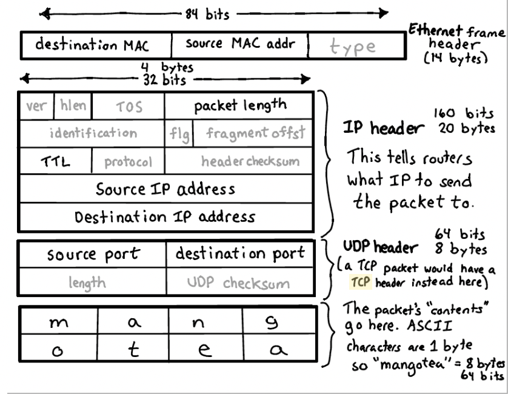
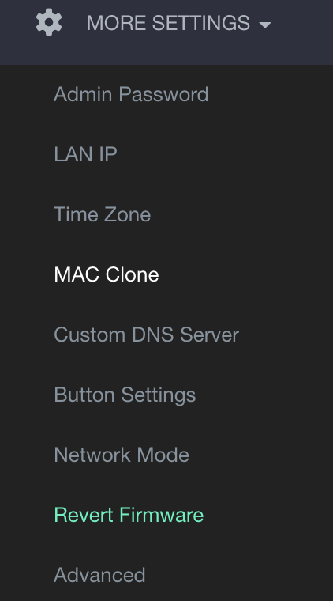
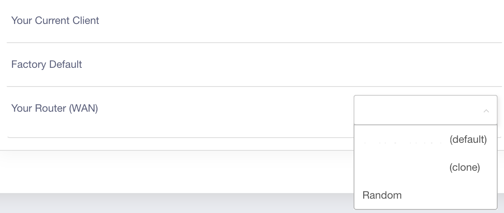

---

title: Hide and Seek with the Internet Provider
#categories: [tech, learnings, productivity]
tags: [internet, personal, service, support, speed]
layout: post
permalink: /hide-and-seek-with-internet-provider
---

With the pandemic becoming the new normal, all of us having been looking at getting better at what we do every day. With my remote setup fully in place (yet to complete blog at this point), I was looking at optimizing every bit of my setup. 
So almost 3 weeks back I started discovering slowness in my internet speed. And the entire experience of dealing with Internet providers and the customer support has taught me a thing or two. So I am documenting my learnings and experience. Bonus: You get to imagine/infer the internet provider.

## Problem Statement & Basic Information ℹ️

I have a 50 Mbps(Mega Bits per second) connection with my internet provider and I was getting only 1/5th of what I should be getting, i.e. ~10 Mbps. Since the time I have started noticing slow internet speed, I have been reporting the speed issues with the Customer Support team and trying to work with them to resolve the issue. Most of the times my tickets on slow speed were closed without addressing the issue and I would be busy to verify if speeds were restored and not bother if the problem was actually resolved. 

Finally one day, I decided to follow on/re-open the same ticket and see if the Support team can help me really close the issue. 
The customer support team also responded back with suggestions on what I can do to resolve this at my end ranging from changing channels on 2.4 GHz network to switching to a 5 GHz if I want to see the full 50 Mbps speed on any device. (More on channels and wi-fi frequencies with other details later in the post). None of these suggestions actually helped me solve the problem. 

After multiple rounds (4-5) of remote troubleshooting, my slow internet speed ticket was assigned to a support person to physically inspect the site (my home and nearby connections) and rectify the problem. Here begins the interesting story.

### Background on Wi-Fi Frequencies 📶

First some background before we get to the real problem. There are 2 bands of Wi-Fi frequencies 2.4 GHz and 5 GHz. Most of the engineering students will remember that Bluetooth, Microwaves, Microwave Ovens, Wireless Lans, Cordless telephones ([allocated in 1998](https://en.wikipedia.org/wiki/Cordless_telephone)), etc. operate in the 2.4 GHz range. More recently even Mobile Phones([LTE](https://en.wikipedia.org/wiki/LTE_frequency_bands) and [5G](https://en.wikipedia.org/wiki/5G_NR_frequency_bands)) too are operating in the 2.4 GHz space. Due to the number of devices that are operating in the 2.4 GHz frequency range there could be interference in the signals and hence the final output will not be optimal.

2.4 GHz has overall 11 channels and you can see it below.

 

5 GHz has support for 23 channels, my router has only 8 (starting at 36 and ending at 161 - need to figure what it translates to and why this range).

Also, 2.4 GHz signals have a larger reach compared to 5 GHz signals. And 5 GHz supports more bandwidth compared to 2.4 GHz. Read [this](https://kb.netgear.com/29396/What-is-the-difference-between-2-4-GHz-and-5-GHz-wireless-frequencies) for more details.

Wi-Fi is based on 802.11 protocol and the first version was released in 1997 and provided up to 2 Mbps speed. This was then updated to 802.11b in 1999. Below is the list of various Wi-Fi generations and their speeds

| Generation/IEEEE Standard             |     Speed     | Adopted | Notes                                                        |
| :------------------------------------ | :-----------: | :-----: | :----------------------------------------------------------- |
| **802.11b** (2.4 GHz)                 |    11 Mbps    |  1999   |                                                              |
| **802.11a** (2.4 GHz)                 |    54 Mbps    |  1999   |                                                              |
| **802.11g** (2.4 GHz)                 |    54 Mbps    |  2003   |                                                              |
| **802.11n** (2.4 GHz/5 GHz)           |   600 Mbps    |  2009   | 150Mbps typical for network adapters, 300Mbps, 450Mbps, and 600Mbps speeds when bonding channels with some routers |
| **802.11ac** (5 GHz)                  |   1300+Mbps   |  2014   | newer standard that uses wider channels, QAM and spatial streams for higher throughput |
| **802.11ax **(2.4 GHz/5 GHz, 1-6 GHz) | 600–9608 Mbps |  2019   | **Wi-Fi 6** expected to become an official IEEE spec in Sep 2020 |

### Troubleshooting/Support ⌛

Once the support person visited my home (to resolve the slow internet speed issue) after checking the nearest distribution box, he checked the WAN connection plugged into my router and asked if he could plug the cable directly into a Computer and check the speed directly. That’s the best and preferred way to test the real internet speed since it is the most direct way of testing. It also removes other factors that could contribute to modifying the speeds owing to interference on wi-fi/router settings et al.

I don’t remember when was the last time I used a LAN cable on any of my machines to access internet. Even on the All-in One of this [slightly older 24 inch MSI](https://www.msi.com/All-in-One-PC/PRO-24X-10M) that I have LAN/ethernet port. We tried the port on my MSI and it did not work and my none of the other devices had any LAN  support. We have begin to rely on Wi-Fi so much that I at least forgot about wired internet. 

The support person ignored the unavailability of LAN support and continued to debug the internet speed issue. After checking the Lan jack/plug (aka RJ45 - with 8 wires) of the WAN cable that was running to my house, he found that one of the wires in the RJ45 jack was not connected well. He gently [crimped](https://www.wikihow.com/Crimp-Rj45) the WAN cable and connected back to my router.

We then tested the wi-fi speed, and there was **no internet**. I was asked to check the router settings (remember this is not the same person who guided me over phone), so I showed him my router settings and I was asked the router make. I said GL(Good Life), to which the support person reacted saying I don’t know how it works.

I used my own router that I had bought while taking the new internet connection from this provider. I bought [this](https://amzn.to/3j3FSd7) GL-AR750S-Ext Gigabit Travel AC Router since it is built on [OpenWrt]( https://openwrt.org/), has support for CloudFlare DNS, supports Mobile Internet, facilitates easy setup for Wiregaurd/OpenVPN), et al. You may read the full description at the above link. I bought from US just before pandemic and it cost me 1/3rd of what it would have to pay in India. Even as of this date, the price difference is still the same (negating the currency fluctuation).

Post discovering my router make (unfamiliar and not providers), the support person started acting differently and kept on saying I am not sure how this router works.

I was then told that my router was at fault. He also kept on saying that lightening and usage could also damage the WAN port and router may slow down or not work. At this point I also felt its best to test on a Computer that can work on wired Internet/ethernet cable. Fortunately our neighbours had a All-in-one Computer that had ethernet support and we got that device and tested the internet. The speed was full ~50Mbps as published. So I also felt that my device was at fault since I was getting the published speed and internet worked off the ethernet cable. I however felt how a working router can stop functioning post a visit by a support person.

I was also advised to replace this current router. It was in the middle of the day when we were troubleshooting so I had to get back to work (remote). Hence I stopped bothering on why my router was not working and started using my mobile Internet as a hotspot. 

### Debugging & Root Cause 🔑

In the evening, I thought of fixing my internet. I had one spare router, a [D-Link DIR-506L, Portable Wireless router](https://amzn.to/2Qu3fRb) so I thought of trying this router to setup the home internet.

After a while the router charged (it’s a portable device that works on battery power) and I was able to set the internet on the new router. Once this was resolved I was relieved of the next day, and I started focusing on why my regular router was not working. 

I picked up my regular router and plugged the WAN cable back into the WAN port. The result was same, no internet. Then I poked around my router settings and saw something interest on the WAN port. There was data movement, see below - Transmitted (Tx) and Received(Rx) packets. 

This was a hope for me as I knew there was more to this entire router becoming dysfunctional. The internet was not working on this router but on other wireless router, so there was something that was blocking this router to send/receive internet packets, was my thought. My obvious doubt was if there is [MAC filtering](https://en.wikipedia.org/wiki/MAC_filtering) applied against my router MAC, it won’t be able to establish internet connection. 

I also recalled this from my reading of the TCP/UDP packet structure and remembered that MAC addresses are sent as part of the [Ethernet frame](https://en.wikipedia.org/wiki/Ethernet_frame) to identify the device to send the response to the original requestor. Since there could be many devices in a LAN behind one public IP address, MAC addresses allow you to identify the device uniquely from amongst a cluster of devices in a network. This is pretty basic, I won't go into details of how the entire thing works. 

  

#### Solution 🚨

This validated my hypothesis of blocking around MAC address. So I tried to see if my router had a way to change the MAC address. To my surprise, I found the option of changing my MAC address under the [MAC Clone]( https://en.wikipedia.org/wiki/MAC_spoofing) on the router

Now the actual page where I can modify the MAC address.

I have scrubbed the MAC addresses here, but as you can see the router itself gives me a random MAC address to choose from. So I went ahead and chose a random MAC and rebooted my router. Once the router started, I was able to access the internet as before.

I was wondering why the support guy did this and was also a little disturbed for some time. I even wanted to post on internet and complain the provider, but I held myself back thinking maybe I am overreacting. I slept over it and the next day I told myself to document/blog my findings for others' reference who might find it useful if they hit such road blocks.

I also felt proud about root causing as I was able to connect the dots, fix the problem(my router :smile:) and root cause this to a mischief by a support person. Nevertheless, I also started thinking how non-techies would respond to this and they would have bought a new router basis the results shown.

There is also one more perspective. Non techies may not buy their own router and also may not nit pick problems of a provider. Both of which I did. 

As a matter of fact, broadband providers hold monopoly today in most places and you are at their mercy to service you. Though there has been competition, in many places only one provider has the infrastructure built and can provide the internet. There is no possibility of other provider in most premises. As we become more and more reliant on basic services like internet, it is important to have the flexibility of choosing from at least 2-3 providers.

**N.B:** I have added affiliate links for amazon, I might get a commission if you using my link

### Closing thoughts 💭

- Demand what you are paying for

- Be persistent till your problem is solved

- Don't stop being curious 

- Situations that appear as problems open doors to learning

- Broadband providers can dictate the service you will get

- Competition in every space is good, leads to better quality and availability  

  

### References 📚

https://jvns.ca/networking-zine.pdf

https://en.wikipedia.org/wiki/Radio_spectrum

https://en.wikipedia.org/wiki/Cordless_telephone

https://en.wikipedia.org/wiki/Wireless_LAN

https://en.wikipedia.org/wiki/Global_Positioning_System

https://www.linksys.com/us/support-article?articleNum=134478

