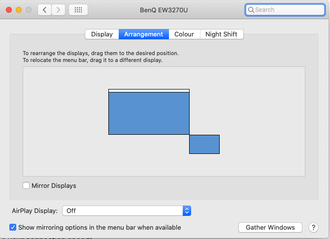
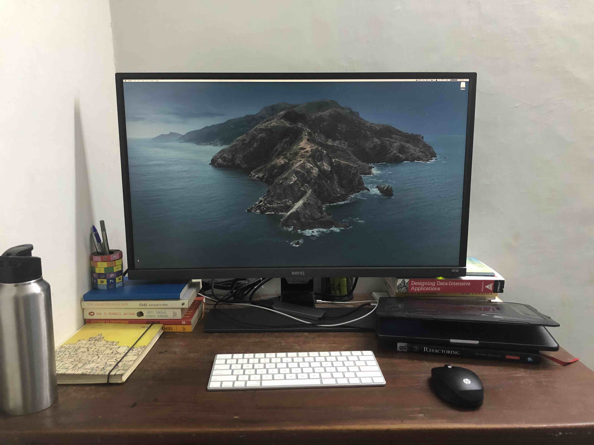

The last six months, we all have been working from home and trying to do our best remotely and staying productive. With this pandemic work from home has become the new normal, and with no vaccine in sight most likely we will continue working from home for quite sometime. 
Personally, I always worked from office and work from home was something I felt was not meant for me and felt very unproductive. But in the last 6 months of working fully remote, I have realized that remote work can also be productive and even big projects can be delivered (involving lots of discussion with the team). When all are working remotely, the entire org works in a way to promote and be effective in remote work. Be it better documentation of requirements, detailed screenshots to back issues reported, architecture diagrams to make things clear for implementation, detailed git commits, better communication on email/teams et al., all teams have adopted more of such examples to stay productive and finish projects. However at the individual level, one also needs to make sure they have the right setup at home to work effectively. Lots of my colleagues and friends have been asking me to write about my remote setup, so here you go.

## Initial Setup ℹ️

I had recently bought a new [MBP 2019](https://support.apple.com/kb/SP799?locale=en_IN) from US just before pandemic so this was the only thing I had when I started working remotely. I also have a [Surface Pro 3](https://en.wikipedia.org/wiki/Surface_Pro_3) which I had bought in Sep 2015 and has been working really well till now, but recently I am using Mac for my work so this is like a backup, just in case if I need one. 

I did not have a bigger monitor at home like I had at office and there was barely anything set for me to work from home on a daily basis. 

So I started working remotely since March 3rd week with just a laptop on a table and a chair from my home. After working for almost 2 months I started developing pain in my hand and wrist. I ignored it for almost a week and was thinking on why this never occured when I was working from an office premise for the last 15 years. After some thinking, I realized I was spending a lot of time on the computer at my desk without much physical movement during office hours. Everything right from architecture discussions, braint storming on new ideas, 1:1 meetings to white-boarding, etc. everything was happening right from the same desk. And I also understood I was spending a lot more time at the same place than I had spent in the past time and all of it was centered around the laptop with my hands and wrist stationed on the laptop almost all the time. After a bit of reading I stumbled on an [article](https://www.swyx.io/writing/rsi-tips/) and understood it was RSI (Repititive Strain Injury). 

So I set out to setup my remote office for the first time and started researching on what comprises an ideal setup.

## What do I need ? 😕

With RSI, it was very clear that my hands and wrists need to feel comfortable and I can't continue just using a laptop for all the work. I also wanted to make sure I had a decent chair for sitting if I was going to spend 8-10 hours on any day with the right height and lighting in the room. Luckily we had a spare room and I was able to decide on using that room for converting into an office.

After some more research, I finally had a list of things I would need and I am listing it here.

-  A 32 inch monitor or 2 * 27 inch monitors with atleast 2K screen resolution support
- A wireless keyboard
- A wireless mouse
- Connectors to power the external monitor from my MacBook Pro
- Webcam for meetings and interviews
- Good earphones

With the list completely ready now I started scouting for the best items possible.

## Scouting 😅

I enjoy scouting/hunting for good products. I like to read detailed reviews about products, understand the pros and cons and love building comparison charts.

### Monitor 

This was the most time consuming one as I have been collecting a lot of information around best monitors for quite sometime. I was completely perplexed about display technologies (TN, VA, IPS). Was also not clear whether I should buy a 4K monitor or something lower in resolution. I was trying to follow this [twitter thread](https://twitter.com/dabit3/status/1258493731151450114?s=21) on monitor recommendations but most of these were not available or were very expensive in India. After a fair bit of research, I landed on an [article](https://techoids.com/best-27-28-29-32-inch-monitors-available-in-india-under-rs30000-big-qhd-1440p-4k-30k-budget-monitors/) that summarized monitor technology and various options available in India quite well.

Armed with this information and some more reading on the pros and cons of using 2 external monitors vs 1 external monitor, I ended up choosing a [32 inch 4K monitor by Benq](https://amzn.to/30cAwFo). If you want to know and read more about display technologies, resolution, ideal sitting distance from monitor I suggest reading the above [article](https://techoids.com/best-27-28-29-32-inch-monitors-available-in-india-under-rs30000-big-qhd-1440p-4k-30k-budget-monitors/).

### Keyboard

I had a couple of  windows wireless keyboards already at home, so I tried using one of them but I felt very unproductive with them. I even tried [Karabiner](https://karabiner-elements.pqrs.org/) but it did not help. I was used to the Cmd Key and Option and Control keys and was already comfortable with the keyboard shortcuts on my MBP. Hence I felt choosing Apple Keyboard would be a better option.

Apple keyboards are very expensive so I looked for this previous version of the [Apple wireless Keyboard](https://amzn.to/3iamj25) as well but it was out of stock. I did not want a [full keyboard](https://amzn.to/2S0zok1) as I was very comfortable typing on my laptop and wanted the same experience to stay productive. Finally I settled on the [Apple Magic Keyboard](https://amzn.to/2G41msG).

### Mouse

I tried a couple of mouse's that I had at home and they simply did not work the way I expected. Most of them were laggy and would stop working in between. I even fixed the mouse drivers but did not help.

I also did not want to spend money on Apple Mouse, end of the day its a bluetooth mouse. Once few of the shops had opened, my wife surpised me with a decent [HP 250 Bluetooth mouse](https://amzn.to/3n4Cu4T).

### Connectors

Back when I had got the MBP, I had also got this [USB Type C Pro Hub](https://amzn.to/342Kaf8) and its fairly good. Allows me to use 3 USB ports, 2 memory card and HDMI. And this one really helped to set things up with the new monitor.

### Webcam

After some digging around, I settled on this [logitech c615](https://amzn.to/3j7bwak) webcam and looking to order it. I currently use the laptop directly for video calls or the phone itself. 

## Setup ⚙️

After choosing all the items needed it was time to buy them. Since it was locked, amazon was not delivering anything except groceries. Luckily I discovered [Jinglebid](https://www.jinglebid.com/) and they were kind enough to take my order on phone (iOS app was not ready then) for both the keyboard and monitor and they delivered them home next day.

With all equipments finally present, I thought the setup would be fairly easy. But it took almost a couple of days to get this in order.

I will go through some of the issues here

### Issues ‼️

The monitor had a HDMI connector & cable and a USB Type C connector & cable. I naturally went with using USB Type C connector for the monitor having read about the 4K resolution support by Type C cables and the inconsistency issues around HDMI cables.

#### USB C

My MBP has 2 USB Type C ports. So when I connected my monitor using the Type C cable, the external monitor was working well but the laptop was also charging. I looked around on the internet to see if there was any solution, but to my suprise there is [none](https://apple.stackexchange.com/questions/353882/macbook-pro-disable-charging-when-connected-to-external-monitor-via-thunderbolt). If someone finds a solution, do let me know.

I wont be concerned so much with battery getting aged with constant charging today, but I was certainly left with no ports to use when my laptop needed charging. (I use the other USB C port for the connector with USB drives and memory card).

So I had to resort to HDMI, which is working really well honestly for the last 3-4 months.

#### Dual monitor support 

Windows has a nifty built dual monitor support. But MacOS lacks it. I did not find any good way to disable my laptop screen. 

Last I settled with below settings to use an external monitor effectively. The white strip on the bigger monitor essentially indicates  /makes it the primary monitor.

#### Mouse

Trying to use a [Logitech wireless mouse](https://www.amazon.in/Logitech-M235-Wireless-Mouse-Grey/dp/B004IO5BMQ/) was a complete failure on Mac. The same mouse works fine on Windows. Some searches on the internet recommended me to [upgrade the firmware](https://discussions.apple.com/thread/250717426) on the mouse. 

I tried all of that but it did not help.

Finally I went ahead with a bluetooth mouse.

### Show the setup 📷

## Closing Thoughts 💭

It took me a while to get the setup right and I personally feel the time I put together in this is worth the effort. 

The 32 inch monitor allows me to use the real estate really well. I have 4 application windows open all the time and I can quickly reach them with a mouse click. I use [Spectacle](https://www.spectacleapp.com/) for managing and placing these windows.

The bigger monitor has also helped me immensely in code review. And the multiple(4) windows have also helped me stay on top of important documents/presentations during meetings while I talk to folks on of the window.

The multiple windows has also helped me research on different topics with ease which otherwise would have taken a lot of Cmd/Tab or cycling between windows.

The external keyboard lets me rest my hands/wrists comfortably on the table and work for longer hours without feeling any strain on my body.

Overall I feel a lot more productive and its worth the investment.

Thanks for reading.

 

