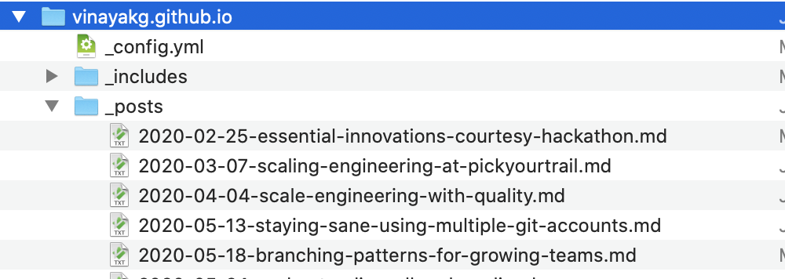
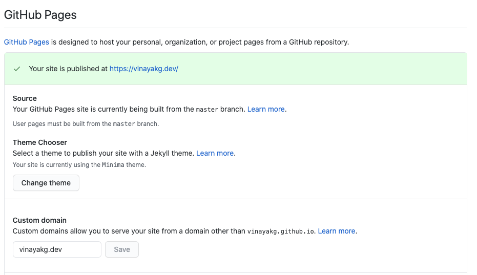

---

title: Setting up your personal website
#categories: [tech, learnings, productivity]
tags: [branding, personal, website, market, blog]
layout: post
permalink: /setup-your-personal-website
---


I have been long contemplating on having my own personal website and start publishing my journal(I maintain notes from the stuff I read on OneNote) so that I can share my learning's with everyone and learn more in return. Have been writing on and off on LinkedIn but having your own domain for a website is a different feeling and helps to market yourself and establish your identity. Having your own website also gives you independence from platforms (like LinkedIn, Medium, facebook, etc.) and you are no more worried about the changes on the platform. 

Also, there have been requests from some of the folks for guidance on setting up their personal website, so I thought I will share my experience with everyone.


### Choosing a TLD

In order to setup a website, you need to first choose a name you prefer. I prefer my own name since this helps me establish my presence on the internet and also provide a single point of reference for any one who wants to know more about me.
The next thing was the TLD (Top Level Domain). And with 1000's of [TLD's](https://www.icann.org/resources/pages/tlds-2012-02-25-en) available I had many options to choose from that represent an individual.

I did not want a **com**, **net** or **org** since they don't represent me. Was contemplating between a **blog** or **dev** and I settled with **dev** since I am a developer by choice and will be professionally as well for sometime and my writings will also be around software development/technology in general. And also they are not expensive anymore (previously costing $ 10K or more).

Once I had zeroed on TLD, I knew where I had to go. Since this TLD is owned by google, I went ahead and signed for my domain name [vinayakg.dev](https://vinayakg.dev)(choose initials from my last name to make it shorter and easy to remember). It was also the cheapest amongst all other providers I searched then. On a side note, .dev is secure by default and is [preloaded](https://hstspreload.org/) on all major browsers (Chrome, Safari, Edge and Firefox), which also meant I needed a SSL/TLS certificate.


### Provider

Then I had to find a home for hosting the website. And I did not want to setup wordpress or any other CMS heavy systems on shared hosting with other customers. I had previously optimized wordpress website to render faster and to have [google pagespeed](https://developers.google.com/speed/pagespeed/insights/) scores of ~100 on both mobile and web, but I felt wordpress was too heavy for my needs and I also did not want to be tracking the [Wordpress Vulnerabilities](https://wpvulndb.com/). 

With the recent surge in [JAM](https://jamstack.org/) applications and the the splurge in [Headless CMS](https://headlesscms.org/) space, it felt the best spot to be in.

While I was thinking of all options, my need was to host a static site to show my content and nothing else. I was thinking of latest JAM stack (netlify, gatsby, aws amplify) et al. I was also thinking of hosting my static site on Cloudfront and setup my own serverless api, all of this for a already solved problem, felt like its not really worth it. Don't re-invent the wheel, I told myself.

I had also considered and tried hosting on [blogger](https://www.blogger.com/) (owned by Google), you can basically host for free on your domain without having to worry about bandwidth costs or hosting costs. But you cannot host a website on root domain, you need a www or something else as sub-domain.

Fortunately, I took a step back and remembered [Github Pages](https://pages.github.com/). Yes github pages and there I had it. I had read about this long time and I knew you could setup your own website for free (yes that's right) and you can use `git` to manage your entire content. `git` is familiar with all developers and hence I went ahead with Github Pages.


### Setup and Experience

Netlify was also one more option that was worth considering, which I did, but hit some blocks, more on that below.

After few searches for setting up Github Pages, I landed on few articles. I had to comb through all of them to figure out the best way (simplest) :smile:

This article was the most [simplest](https://nicolas-van.github.io/easy-markdown-to-github-pages/) and I followed it to get going. 

Now the task was to add the articles I had written to show up on github, so I added them as posts, Please see below.



The other best thing about Github pages is you can write content using [Markdown](https://www.markdownguide.org/), have been using Markdown for many years to write technical documents and I love using everytime. Markdown formatting is consistent across all browser/devices and is easy to learn. Tools like [typora](https://typora.io/), [markdownpad](http://markdownpad.com/) and [zettlr](https://www.zettlr.com/#) make it very easy to write in Markdown. I personally prefer **Zettlr**. 

#### Steps

After pushing the posts to git (with other files as per above blog) to my repository,  I had to just enable github pages for my repository named as [vinayakg.github.io](https://github.com/vinayakg/vinayakg.github.io)

After some tinkering I was able to access my pages, with the url.

Now it was time to setup a A record on my DNS provider's website (its google domains) and I was set.

Google Domains’ UI was not very intutive and is very different from other providers like route 53 or dyndns or dnsmadeeasy.

I looked up these links [here](https://docs.github.com/en/github/working-with-github-pages/configuring-a-custom-domain-for-your-github-pages-site) and [here](https://docs.github.com/en/github/working-with-github-pages/managing-a-custom-domain-for-your-github-pages-site),  after adding those entries in few minutes I was able to resolve my domain.

I also had to enable HTTPS to access my website since my domain is .dev and is secure by default (basically .dev is on HSTS list). Once I enabled HTTPS on my site, it took only a minute or two for the TLS certificate to be assigned. Github Pages uses [LetsEncrypt](https://letsencrypt.org/) to issue certificates for personal websites created on GIthub Pages.




I tried the same steps for setting up my custom website on [Netlify](https://netlify.com), but the HTTPS option took a long time to get enabled, waited for 10-15 mins and I gave up. I am not sure if this happened as even Netlify uses LetsEncrypt for TLS Certificates and I already had a certificate assigned against my domain or it could be an error too on the Netlify side.

With this the setup is complete and we are good to start publishing articles one after the other.

### Visibility and Maintenance

Now with our setup completely done, I just had few questions around how to link all my posts to show on one page, how do I tag my articles, how do I put date and other things and how do I set up About page, and other sections, etc. Also how do I manage images end of the day,

If you use some other provider(outside Github Pages), you might end up choosing an image provider (paid or free) whom you will forget to renew or maintain and your website in the future will not be rendering images, seen that multiple times and used to hate that when I saw that with even some of the best blogs by renowned folks. I decided to use the same GitHub repository itself for storing the images.


One important thing, how do we make sure Google and other search engines crawl our pages, else your content will never be discovered organically. Yes, I mean managing the SEO for your website.

So I looked around and Jekyll had a lot to offer. Github pages is built on Jekyll, which is based on [Ruby on Rails ](https://rubyonrails.org/) framework. This is the first time I tried Jekyll and Ruby on Rails, though I had heard and read in passing many times in the past.

Then, I started exploring [jekyllrb](https://jekyllrb.com/) and figured that I can do a lot of stuff in very few easy to follow steps.

There is also an [admin/CMS](https://jekyll.github.io/jekyll-admin/) for the entire jekyll website that one can configure. 

#### Steps

I followed the installation link for [MacOS](https://jekyllrb.com/docs/installation/macos/) and followed the steps to setup jekyll on my machine, all instructions worked mostly expect my default ruby was pointing to old (~~don’t know how it got installed~~ - it actually got installed with a `brew` package).

The ruby I installed using`brew` was not available on [PATH](https://en.wikipedia.org/wiki/PATH_(variable)), so had to set that in path

```bash
export PATH="/usr/local/Cellar/ruby/2.7.1_2/bin:$PATH"
```
Then I ran the below commands and I was able to render the changes locally`
```bash
gem install bundler jekyll
jekyll new my-awesome-site
cd my-awesome-site
bundle exec jekyll serve # render locally
```


##### **SEO**

Make sure you enable sitemap generation and seo-tag generators so that search engine crawlers can crawl and present our website content on search results based on relevant queries. 

```yaml
theme: minima
plugins:
  - jekyll-feed
  - jekyll-seo-tag
  - jekyll-sitemap
```

You may easily add themes to your website from the many the available themes for jekyll. I use [minima](https://github.com/jekyll/minima). 

#### Things that surprised me

Once you put all your posts in _posts folder with yyyy-mm-dd-pagetitle.md format,  jekyll uses this information to figure datetime and order your posts accordingly on the landing page (index.html).

There is OOB(out of the box) RSS support.

There is a default About Page which is a good start.

You may use the `Permalink` tag in each post if you need custom links (we all need :))

And of course themes for quick playing around


### Next Steps

- Change the theme
- Setup Commenting on the blog, I dont like disqus or Facebook commenting (loads of trackers and assets - render the website slow)
- Choose a new theme
- Try admin interface and explore possibilities.


